# ESP32 Pixel Matrix

My little attempt on making a slim pcb for a pixel matrix with a Esp32 Nano board.

Made this last year to have on my sailing boat and it nicely show speed and bearing while mounted on the mast.

At first the display didn't seem so bright but on a longer distance it actually works well.

Below is a photo from sailing, the frame rate of the display does not match the shutter speed so all pixels are not lit. In real life it looks pretty good!

[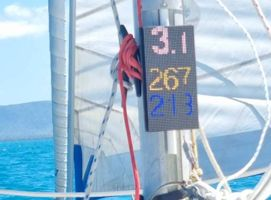](gfx/rogue/rogue-led.jpg)

I made a simple program to draw on the display passing json via a web server: [code/esp-ledpx](code/esp-ledpx).

Then I made another basic one to animate gif's uploaded via a web page. [code/esp-gif-mtx](code/esp-gif-mtx).

It was a while since I made a PCB and after having enough of the cable mayhem that connecting these boards up I ended up drawing a PCB and ordered it pre-soldered.

Below is most of the process documented, use it at your own risk...

# Assembly

The assembled display below.

[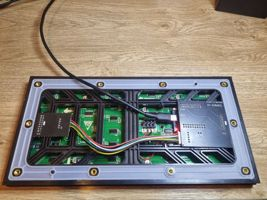](gfx/ic/assembled-back.jpg)
[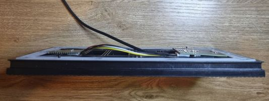](gfx/ic/assembled-side.jpg)

The full kit, showing how some of the reinforcement brackets have been cut.

[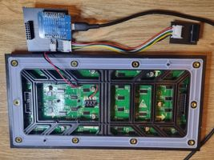](gfx/ic/detached-back.jpg)

For extra slim fit, solder on the headers on the ESP, then remove the spacers and then cut the pins 2-3 mm. The cut pins be seen in the picture below.

[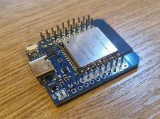](gfx/ic/esp-mini-soldered.jpg)

# Power

On the boat I powered it via a 12->5v converter and the ESP got it's power from Vin.

At home I instead powered the display from the ESP via USB which seems to work fine.

# Schematic

All files for the schematic with bom for ordering can be found under [schematic/pcb](schematic/pcb).

There are also a sketch on how to wire it up in [schematic/drawio](schematic/drawio)

With the esp mini pinout in [schematic/esp32mini](schematic/esp32mini)

## PCB

I created the schematic with [easyeda.com](https://easyeda.com) and had it manufactured and assembled with [jlcpcb.com](https://jlcpcb.com).

5 pieces was 30.04$.

I think it was some intro offer because on a later project the price was significantly higher.

The board should be cut along the drilled holes to split it in the two parts.

[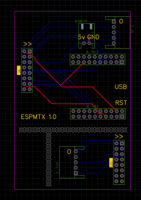](schematic/easyeda/schematic.png)
[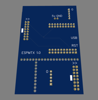](schematic/easyeda/top.png)
[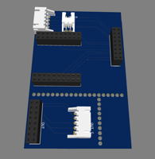](schematic/easyeda/bottom.png)

## Parts

### Display
64x32 P4 Display (AU$23.11 + shipping + tax = AU$38)

[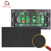](gfx/aliexpress/display.png)

> P4 Outdoor SMD 256x128mm LED Display Module

https://www.aliexpress.com/item/1005003269876713.html

### ESP32 Mini
Microcontroller (AU$4.40 + tax = AU$4.80)

[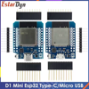](gfx/aliexpress/esp32mini.png)

> D1 Mini ESP32 ESP-32 WiFi+Bluetooth Internet of Things Development Board based ESP8266 Fully Functional

https://www.aliexpress.com/item/1005006414001036.html

### Diy Connectors
For creating the cable between the two connectors of the display

[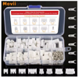](gfx/aliexpress/jst-diy.png)

> 230pcs 2.54mm JST Connector Kit XH-2.54 2/3/4/5/6 Pin Male&Female Housing Connector Adapter Plug 2.54mm Pitch Wire Terminal Kit

https://www.aliexpress.com/item/1005006447186101.html

### Jst 5 pin cables

[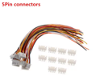](gfx/aliexpress/jst-5pin.png)

> 10Sets 2/3/4/5/6/7/8/9/10 Pin Pitch Male Female Plug Socket JST XH2.54 XH 2.54mm 15cm Wire Length 24AWG Wire Cable Connector

Color: `10Set 5Pin`

https://www.aliexpress.com/item/32964549472.html

### Jst 2 pin cables

[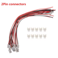](gfx/aliexpress/jst-2pin.png)

> 10Sets 2/3/4/5/6/7/8/9/10 Pin Pitch Male Female Plug Socket JST XH2.54 XH 2.54mm 15cm Wire Length 24AWG Wire Cable Connector

Color: `10Set 2Pin`

https://www.aliexpress.com/item/32964549472.html

# Code

The code is a litte bit experimental and not something complete, but it is in usable state.

## ESP LedPx
Web server that allows simple drawing of text and basic shapes.
[code/esp-ledpx](code/esp-ledpx)

## ESP Gif Mtx

Web server that allows uploading of gif images, can set framerate in the interface.
[code/esp-gif-mtx](code/esp-gif-mtx)

[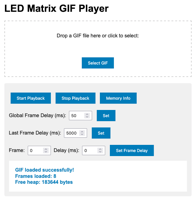](gfx/code/led-gif-mtx.png)

# References

Display Library and overview of how to wire the display.
https://github.com/2dom/PxMatrix/

Custom ESP8266 PCB
https://github.com/mike-rankin/ESP8266_RGB_Matrix_Cable_Version

ESP32 Mini Shield
https://www.tindie.com/products/brianlough/esp32-matrix-shield-mini-32/
